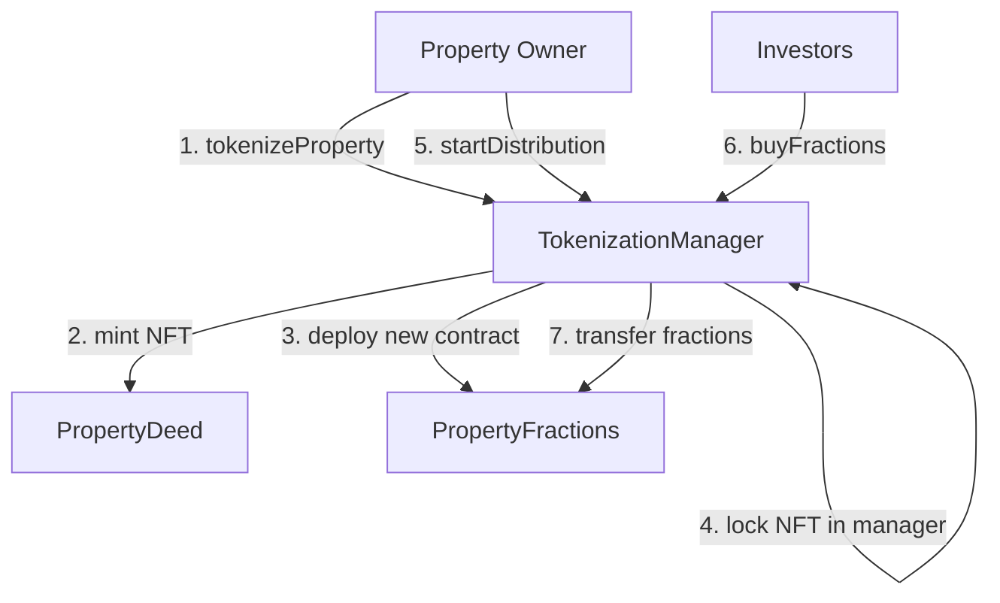

 Hi, I’m iamparth.eth 


# PropToken - Real Estate Tokenization System

A comprehensive smart contract system for tokenizing real estate properties and enabling fractional ownership through blockchain technology.

## 🏗️ Architecture Overview

PropToken consists of three interconnected smart contracts that work together to enable secure real estate tokenization:

### 1. PropertyDeed.sol - Master Property NFT
- **Purpose**: Represents legal ownership of unique real estate properties as ERC-721 NFTs
- **Key Features**:
  - Each NFT represents one unique property
  - Only contract owner can mint new property deeds
  - Stores property metadata via token URI
  - Acts as the master record of property ownership

### 2. PropertyFractions.sol - Fractional Ownership Shares
- **Purpose**: ERC-20 tokens representing fractional ownership shares of a specific property
- **Key Features**:
  - Each deployment is linked to a specific PropertyDeed NFT
  - Fixed total supply of tokens (configurable per property)
  - Standard ERC-20 functionality for trading fractions
  - Automatically minted to property owner upon creation

### 3. TokenizationManager.sol - Core Orchestration Contract
- **Purpose**: Main contract that orchestrates the entire tokenization lifecycle
- **Key Features**:
  - Manages the tokenization process from start to finish
  - Holds PropertyDeed NFTs in escrow during fractionalization
  - Handles fraction sales and distribution
  - Maintains registry of all tokenized properties

## 🔄 Contract Interaction Flow



### Step-by-Step Process:

1. **Tokenization**: Property owner calls `tokenizeProperty()` on TokenizationManager
2. **NFT Minting**: Manager mints a PropertyDeed NFT representing the property
3. **Fraction Creation**: Manager deploys a new PropertyFractions contract
4. **Escrow**: PropertyDeed NFT is locked in the TokenizationManager
5. **Distribution Setup**: Owner sets price and starts public distribution
6. **Investment**: Users can buy fractions with ETH via `buyFractions()`

## 🛡️ Security Features

- **OpenZeppelin Integration**: Uses battle-tested implementations for ERC-721 and ERC-20
- **Access Control**: Ownable pattern restricts sensitive functions
- **NFT Escrow**: PropertyDeed NFTs are locked during fractionalization
- **Payment Validation**: Strict payment verification for fraction purchases
- **Input Validation**: Comprehensive checks for all user inputs

## 📁 Project Structure

```
hardhat-tutorial/
├── contracts/
│   ├── PropertyDeed.sol
│   ├── PropertyFractions.sol
│   └── TokenizationManager.sol
├── test/
│   └── tokenization-test.js
├── scripts/
│   └── deploy.js
├── hardhat.config.js
├── package.json
└── README.md
```

## 🚀 Getting Started

### Prerequisites

- Node.js (v16 or higher)
- npm (v7 or higher)
- Git

### Installation

1. **Clone the repository**:
   ```bash
   git clone <repository-url>
   cd hardhat-tutorial
   ```

2. **Install dependencies**:
   ```bash
   npm install
   ```

3. **Install additional required packages** (if not already installed):
   ```bash
   npm install --save-dev hardhat @nomicfoundation/hardhat-toolbox
   npm install @openzeppelin/contracts
   ```

## 🔧 Compilation

Compile all smart contracts:

```bash
npx hardhat compile
```

This will:
- Compile all Solidity contracts in the `contracts/` directory
- Generate artifacts in the `artifacts/` directory
- Check for compilation errors and warnings

## 🧪 Testing

### Run All Tests

```bash
npm test
# or
npx hardhat test
```

### Run Specific Test Categories

The test suite covers:
- ✅ Property tokenization flow
- ✅ Distribution setup and controls
- ✅ Fraction buying and selling
- ✅ Access control and security
- ✅ Edge cases and error conditions
- ✅ ERC721 and ERC20 compliance

### Test Coverage Areas

1. **Tokenization Tests**: Verify property tokenization process
2. **Distribution Tests**: Test price setting and distribution controls
3. **Purchase Tests**: Validate fraction buying with various scenarios
4. **Security Tests**: Ensure proper access control
5. **Edge Case Tests**: Handle boundary conditions and error states

## 🚀 Deployment

### Local Development Network

1. **Start a local Hardhat network**:
   ```bash
   npm run node
   # or
   npx hardhat node
   ```

2. **Deploy contracts to local network**:
   ```bash
   npm run deploy
   # or
   npx hardhat run scripts/deploy.js --network localhost
   ```

### Deployment to Other Networks

1. **Configure network in `hardhat.config.js`**:
   ```javascript
   networks: {
     sepolia: {
       url: "https://sepolia.infura.io/v3/YOUR-PROJECT-ID",
       accounts: ["YOUR-PRIVATE-KEY"]
     }
   }
   ```

2. **Deploy to target network**:
   ```bash
   npx hardhat run scripts/deploy.js --network sepolia
   ```

## 💡 Usage Examples

### Tokenizing a Property

```javascript
// Connect to deployed TokenizationManager
const manager = await ethers.getContractAt("TokenizationManager", managerAddress);

// Tokenize a property
await manager.tokenizeProperty(
  "Luxury Villa Token",     // name
  "LVT",                   // symbol
  1000000,                 // total supply (1M fractions)
  "https://metadata.uri"   // property metadata URI
);
```

### Starting Distribution

```javascript
// Set price per fraction (1 ETH in this example)
const pricePerFraction = ethers.parseEther("1.0");
await manager.startDistribution(0, pricePerFraction); // propertyId = 0
```

### Buying Fractions

```javascript
// Buy 100 fractions
const fractionsAmount = 100;
const totalCost = ethers.parseEther("100"); // 100 ETH for 100 fractions

await manager.buyFractions(0, fractionsAmount, { 
  value: totalCost 
});
```

### Checking Balances

```javascript
// Check user's fraction balance
const balance = await manager.getUserFractionBalance(0, userAddress);
console.log(`User owns ${balance} fractions of property 0`);
```

## 🔍 Key Functions Reference

### TokenizationManager Contract

| Function | Description | Access |
|----------|-------------|---------|
| `tokenizeProperty()` | Create new tokenized property | Public |
| `startDistribution()` | Set price and enable sales | Property Owner |
| `buyFractions()` | Purchase property fractions | Public (Payable) |
| `getUserFractionBalance()` | Check user's fraction balance | View |
| `getFractionsAddress()` | Get ERC20 contract address | View |

### PropertyDeed Contract

| Function | Description | Access |
|----------|-------------|---------|
| `mint()` | Mint new property NFT | Owner Only |
| Standard ERC721 functions | Transfer, approve, etc. | Standard |

### PropertyFractions Contract

| Function | Description | Access |
|----------|-------------|---------|
| Standard ERC20 functions | Transfer, approve, balance, etc. | Standard |

## 🐛 Troubleshooting

### Common Issues

1. **Compilation Errors**:
   - Ensure Solidity version compatibility (^0.8.24)
   - Check OpenZeppelin contract imports

2. **Test Failures**:
   - Verify all dependencies are installed
   - Check network configuration
   - Ensure sufficient ETH for gas in tests

3. **Deployment Issues**:
   - Confirm network configuration
   - Verify account has sufficient ETH for deployment
   - Check contract constructor parameters

### Debug Commands

```bash
# Verbose compilation
npx hardhat compile --verbose

# Run tests with gas reporting
npx hardhat test --gas-report

# Check contract size
npx hardhat compile --size-contracts
```

## 🔒 Security Considerations

1. **Smart Contract Auditing**: Consider professional audit before mainnet deployment
2. **Access Control**: Verify owner permissions are correctly implemented
3. **Economic Attacks**: Be aware of potential front-running and MEV issues
4. **Upgrade Patterns**: Current contracts are not upgradeable by design
5. **Emergency Procedures**: No pause functionality - consider adding for production

## 🎯 Future Enhancements

- **Governance System**: Token holder voting on property decisions
- **Yield Distribution**: Automatic rental income distribution
- **Secondary Markets**: DEX integration for fraction trading
- **Oracle Integration**: Real-time property valuation
- **Cross-chain Support**: Multi-blockchain deployment

## 📝 License

This project is licensed under the MIT License - see the contract headers for details.

## 🤝 Contributing

1. Fork the repository
2. Create a feature branch
3. Make your changes
4. Add tests for new functionality
5. Ensure all tests pass
6. Submit a pull request

## 📞 Support

For questions or issues:
- Create an issue in the repository
- Check existing documentation
- Review test cases for usage examples

---

**Built with ❤️ using Hardhat, OpenZeppelin, and Solidity**
